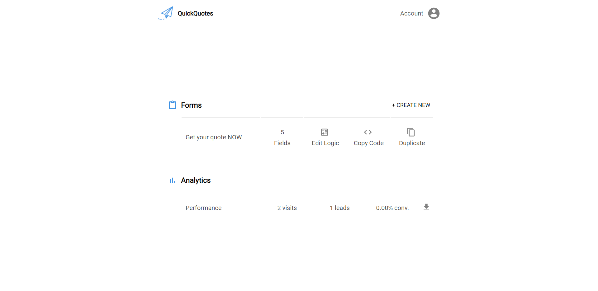
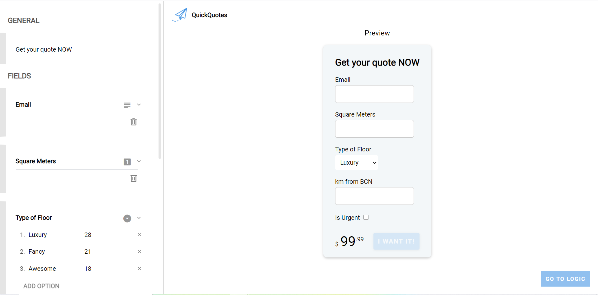
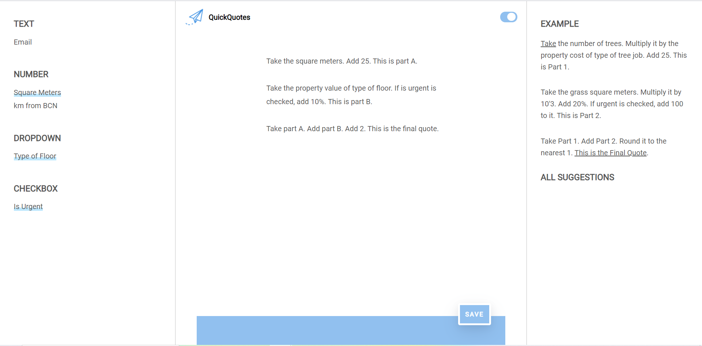

  

Quick Quotes is a no-code tool that allows small business owners to offer dynamic quotes to their clients, directly from their website.

## Demo Video

## Screenshots

  

  

  

## Built with

* [React](https://reactjs.org/) - A JavaScript library for building user interfaces
* [Redux](https://redux.js.org) - Storage to share data inside the app
* [Express](https://expressjs.com/) - Fast, unopinionated, minimalist web framework for Node.js
* [Handlebars](https://handlebarsjs.com/) - Minimal templating on steroids
* [MongoDB](https://www.mongodb.com/3) - A complete data framework
* [Mongoose](https://mongoosejs.com/) - Elegant mongodb object modeling for node.js
* Love, lots of love ♥

## Author

Jaume Fàbrega - [Github](https://github.com/jaumefabrega) - [LinkedIn](https://www.linkedin.com/in/jaumefabrega/)

## License

All rights reserved.